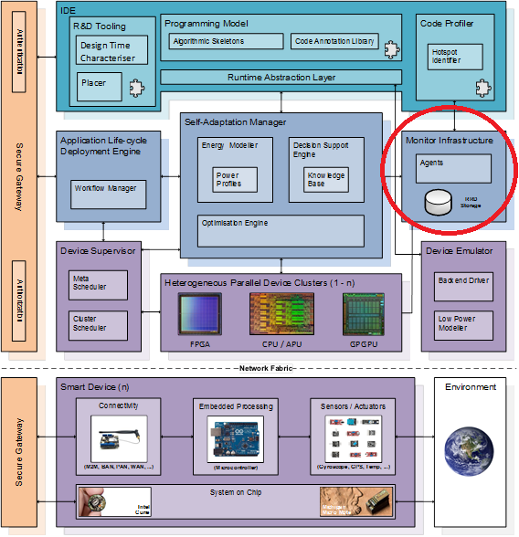

# Monitor Infrastructure

[](https://travis-ci.org/TANGO-Project/monitoring-infrastructure)

&copy; Atos Spain S.A. 2016

The Monitor Infrastructure is a component of the European Project TANGO (http://tango-project.eu ).

-----------------------

[Description](#description)

[Component architecture](#component-architecture)

[Installation Guide](#installation-guide)

[Usage Guide](#usage-guide)

[Relation to other TANGO components](#relation-to-other-tango-components)

-----------------------

### Description

The responsibility of this component is twofold. On one side it must provide running applications with metrics of the status of different devices, such as CPU, GPUs, FPGAs, etc. This information should be both energy consumption and performance status. On the other side it should also provide historical statistics for device metrics for latter analysis of upper components of the TANGO architecture.



This component relies on [Collectd](https://collectd.org/), which will be used together with some [custom plugins](Collectd) done specifically for TANGO, in order to get and store energy consumption and performance values from the applications running in the different environments.

Available collection of probes to measure energy in heterogeneous hardware for the TANGO project: (http://tango-project.eu)
1. [NVIDIA collectd plugin](Collectd/nvidia_plugin) :white_check_mark:

2. [Xeon Phi collectd plugin](Collectd/xeon_phi_plugin) (needs to be tested)

3. [IPMI plugin from collectd](Collectd/ipmi_plugin) (needs to be tested)

-----------------------

### Component architecture


-----------------------

### Installation Guide

##### 1. Install Collectd

```bash
sudo apt-get update
sudo apt-get install collectd collectd-utils
```

###### 1.1. Install plugins

View [Collectd - Readme file](Collectd/README.md) to see how to compile and install the plugins.

##### 2. Install InfluxDB  (ubuntu, 64-bit systems)

```bash
wget https://dl.influxdata.com/influxdb/releases/influxdb_0.13.0_amd64.deb
sudo dpkg -i influxdb_0.13.0_amd64.deb
sudo service influxdb start
sudo service influxdb statu
```

##### 3. Install Grafana

```bash
wget https://grafanarel.s3.amazonaws.com/builds/grafana_3.0.4-1464167696_amd64.deb
sudo apt-get install -y adduser libfontconfig
sudo dpkg -i grafana_3.0.4-1464167696_amd64.deb
```

##### 4. Collectd & InfluxDB & Grafana setup

See [Monitoring with Collectd, InfluxDB & Grafana](http://www.vishalbiyani.com/graphing-performance-with-collectd-influxdb-grafana/) for more information about how to setup the three components.


##### 5. Install and configure the REST API component

View [rest-api - Readme file](rest-api/README.md) to see how to install and configure the REST API component.

-----------------------

### Usage Guide

-----------------------

### Relation to other TANGO components
