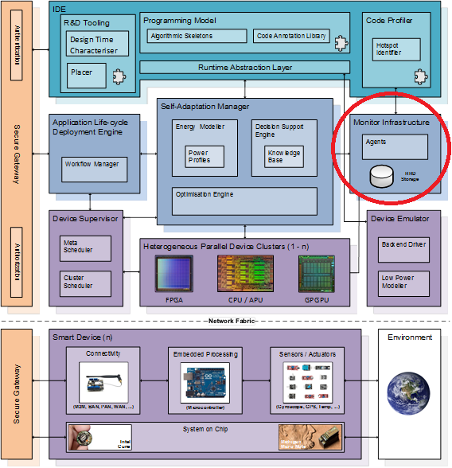
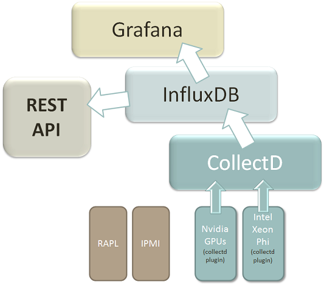

# Monitoring Infrastructure

&copy; Atos Spain S.A. 2016

The Monitoring Infrastructure is a component of the European Project TANGO (http://tango-project.eu ).

-----------------------

[Description](#description)

[Component architecture](#component-architecture)

[Installation Guide](#installation-guide)

[Usage Guide](#usage-guide)

[Relation to other TANGO components](#relation-to-other-tango-components)

-----------------------

### Description

The responsibility of this component is twofold. On one side it must provide running applications with metrics of the status of different devices, such as CPU, GPUs, FPGAs, etc. This information should be both energy consumption and performance status. On the other side it should also provide historical statistics for device metrics for latter analysis of upper components of the TANGO architecture.



This component relies on [Collectd](https://collectd.org/), which will be used together with some [custom plugins](Collectd) done specifically for TANGO, in order to get and store energy consumption and performance values from the applications running in the different environments.

Available collection of probes to measure energy in heterogeneous hardware for the [TANGO project](http://tango-project.eu):
1. [NVIDIA collectd plugin](Collectd/nvidia_plugin) :white_check_mark:
    - power
    - temperature
    - memory used
    - usage
    - processes running


2. [Xeon Phi collectd plugin](Collectd/xeon_phi_plugin) :white_check_mark:
    - power
    - temperature
    - memory used
    - usage


3. [IPMI plugin from collectd](Collectd/ipmi_plugin) (needs to be tested)

-----------------------

### Component architecture

#### Components
The monitoring Infrastructure is composed by the following components:

###### Collectd & plugins

[Collectd](https://collectd.org/) is a daemon which collects system and application performance metrics periodically and provides mechanisms to store the values in a variety of ways. The TANGO Collectd plugins provide metrics from specific devices like the NVIDIA GPUs and the XEON PHI processors. The metrics gathered from this component are stored in the InfluxDB instance.

###### InfluxDB

[InfluxDB](https://www.influxdata.com/) is used as a data store for the metrics gathered from *Collectd*. The *REST API* and the *Graphana* applications connect to this tool in order to present the processed information.

###### Graphana

[Graphana](https://grafana.com/) is a data visualization and monitoring tool with support for Graphite, *InfluxDB* and many more databases. This component is used as the GUI of the monitoring component.

###### [REST API](rest-api/README.md)

The main purpose of the *REST API* application is to offer to other TANGO components the information they need from the metrics gathered from *Collectd*.

View [REST API specification](https://github.com/TANGO-Project/monitor-infrastructure/tree/master/rest-api#api-methods) to see the available methods.

#### Architecture



-----------------------

### Installation Guide (ubuntu, 64-bit systems)

##### 1. Requirements

- ubuntu 64-bit system
- Java 8
- [Leiningen]() 2.0.0 or above installed.

##### 2. Install Collectd

```bash
sudo apt-get update
sudo apt-get install collectd collectd-utils
```

###### 2.1. Install plugins

View [Collectd - Readme file](Collectd/README.md) to see how to compile and install the plugins.

##### 3. Install InfluxDB

```bash
wget https://dl.influxdata.com/influxdb/releases/influxdb_0.13.0_amd64.deb
sudo dpkg -i influxdb_0.13.0_amd64.deb
sudo service influxdb start
sudo service influxdb statu
```

##### 4. Install Grafana

```bash
wget https://grafanarel.s3.amazonaws.com/builds/grafana_3.0.4-1464167696_amd64.deb
sudo apt-get install -y adduser libfontconfig
sudo dpkg -i grafana_3.0.4-1464167696_amd64.deb
```

##### 5. Collectd & InfluxDB & Grafana setup

See [Monitoring with Collectd, InfluxDB & Grafana](http://www.vishalbiyani.com/graphing-performance-with-collectd-influxdb-grafana/) for more information about how to setup the three components.


##### 6. Install and configure the REST API component

View [rest-api - Readme file](rest-api/README.md) to see how to install and configure the REST API component.

-----------------------

### Usage Guide

- [GRAFANA](https://grafana.com/)

- [REST API](rest-api/README.md)

-----------------------

### Relation to other TANGO components

The other TANGO components connect to the monitoring Infrastructure through the REST API application:

- Programming model

- heterogeneous parallel device clusters

- Energy modeller

- Self-Adaptation Manager
